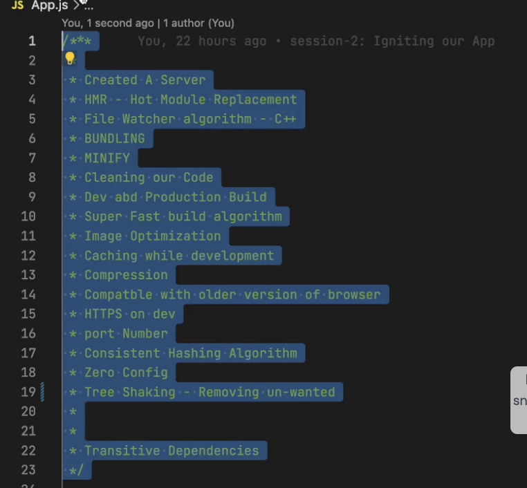

## Polyfill
a code which is a replacement for the newer version of code
babel converts the code 

## npx
It is executing a package without downloading it

babel plugin transform remove console

## Why do we need a key?

render:updating something in the dom
step1: suppose our html is look something like this 

      <ul>
          <li>first</li>
          <li>Second</li>
          
      </ul>

step2: Now I included one more tag in my html so what it will do it will just append my li third over here

        <ul>
             <li>first</li>
             <li>Second</li>
             <li>Third</li>
        </ul>

step3: But what if ? we have something like this 1st <li > is "duke" and  second li is "villenova"

      <ul>
          <li>Duke</li>
          <li>Villanova</li>
      </ul>

step4: Suppose I introduced one more <li> on the top then react will have do alot of efforts to fix it, React will have to re-render every thing so it will not give you good performance , so in large scale application there can be so many childrens so it has to do so many calculations about where that new child came in from but if you give keys to them 

<b>so what does it mean to rerender every thing?</b>

that means react will ahve to change the whole dome tree

    <ul>
        <li>Connection cut</li>
        <li>Duke</li>
        <li>Villanova</li>
    </ul>

step 5: suppose if you give keys to them  then react has to do very less work which means it does not have to modify everything inside the dom , it just injects it which means

For Eg. --> here we want to add "Connection cut" inside the list we just give it a key "2014" then it will insert it to that perticuler positon which mean it just insert into the list , react does not have to modify whole dom
     
     so thats why keys are important and we should always use it when you have multiple childrens :-).
      <ul>
          <li key="2015">Duke</li>
          <li key="2016">Villanova</li>
      </ul>

      <ul>
        <li key="2014">Connection cut</li>
        <li key="2015">Duke</li>
        <li key="2016">Villanova</li>
    </ul>

## now how does React.createElement work?
 React.createElement() gives us an object 
 and then what happens with the objects? objects are then concerted into the html code and it is put up on the dom|

  React.createElement() => object => Html Code 

  for eg 
  const heading = React.createElement

  ("h1",

  {
    id:"title,

    key:"h1"
  },
  "Heading 1for parcel"
  );

if we build our app with react.createElement then there will be huge mess and out code will become lenthier so there is something known as jsx

## What is jsx
 Jsx is a html like syntax but it is not html inside javaScript ,and jsx build by facebook developers
 jsx  allows us to write html like syntax in javascript

 ## How does jsx executes
 browser don't understand jsx code so "Babel " converts jsx code into normal code and gives it to the browser

what does jsx do is the jsx uses react.createElement behind the scenes and it gives us an object and the object is converted to html dom

JSX ===> React.createElement ===> Objects ===> HTML (DOM)

Advantages:
Readability
maintainability

## Advantages of parcel bundler

## Components in React
Everything is a component in react
1. <b>Functional Component</b>-
<ul>
 <li>new way of writing code</li>
  <li>functinal component nothing but a normal function which returns jsx codeor it can return react element </li>
   <li>functinal component or any component that name starts with a capital letters, it is not mandatory but its a good practice</li>
</ul> 
2. <b>Class Based Component</b>-old way of writing code

## Component Composition

component inside the component is called component composition. 
